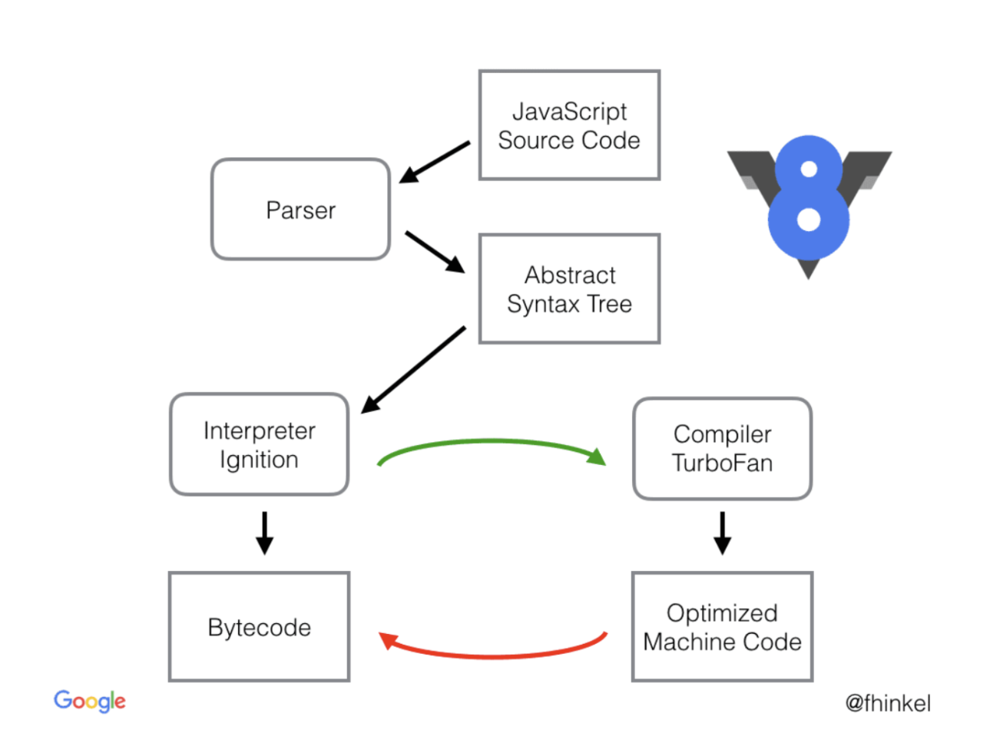

# JS 엔진 (Google V8)

# JS 엔진이란?

JS 코드를 해석하고 실행하는 프로그램 혹은 인터프리터. 가능한 짧은 시간 내에 가장 최적화된 코드를 생성하는 것이 목표. 대표적인 예는 크롬과 Node.js에서 사용되는 Google V8 엔진. 해당 페이지는 V8엔진에 대해 정리한다.

JS 엔진은 작성된 코드를 JS 스펙에 맞추어 컴파일하고 실행한다. JS 엔진은 특정 버전의 ECMAScript를 구현하기 때문에, ECMAScript가 발전하는 만큼 엔진도 발전한다. JS는 프로그래밍 언어를 나타내고, JS 엔진은 내부에서 컴파일하고 처리하는 역할을 가진다.

# JS 런타임

브라우저 내장 API(Web API)는 JS 엔진에서 제공하는 것이 아니다.

## 콜 스택, 콜백 큐

setTimeout을 포함하고 있는 함수가 실행된다고 하면

1. 함수는 콜 스택에 올라가고
2. setTimeout은 콜백 큐에 넣어진다
3. 이벤트 루프는 콜 스택과 콜백 큐를 감시하면서 콜 스택이 비워지게 되면 콜백 큐에 대기 중인 항목이 있는지 확인하고 있으면 스택에 올림

## 이벤트 루프

JS는 싱글 스레드 기반 언어다. 호출 스택이 하나. 따라서 **한 번에 한 작업만 처리할 수 있다.** 싱글 스레드 기반 코딩은 멀티 스레드 환경에서 생각해야하는 복잡한 것들을 생각해도 되지 않아 쉽지만 제약이 많다.

호출 스택이 한 개인데 실행이 느려진다면? 브라우저의 렌더링 시간은 기약없이 길어지고 부자연스러운 UI가 사용자를 맞이한다. 너무 길어지면 브라우저는 결국 에러를 띄우게 되고 페이지를 종료하는 수순을 밟게 된다. 그에 대한 해결책이 비동기 콜백.

# 비동기 콜백

페이지 렌더링을 방해하지 않고 응답도 유지하면서 실행 시간이 긴 함수를 실행하는 방법 → **엔진 중심 코딩**

# V8

V8은 속도 향상을 위해 코드 한 줄을 해석하고 바로 실행하는 인터프리터 형식을 사용하는 대신 JS 코드를 바이트 코드로 컴파일 하고 실행하는 방식을 사용한다. 또한 V8 엔진은 독립형으로 개발되어 웹 브라우저 뿐 아니라 C++ 프로그램에 별도로 내장하여 실행시킬 수 있는 강점이 있다. 하드웨어 레벨에 가까운 언어인 C++로 작성한 것을 JS에서 동작하도록 한다면 순수 JS로만 할 수 있는 것보다 훨씬 더 많은 일을 할 수 있다.

JS 코드를 가져와서 파서에게 넘기면 소스 코드를 분석한 후 AST(Abstract Syctax Tree, 추상 구문 트리)로 넘긴다. 파싱되어 만들어진 AST는 Ignition으로 넘어간다. Ignition은 JS 코드를 바이트 코드로 변환하는 인터프리터이다. 원본 소스 코드보다 컴퓨터가 해석하기 쉬운 바이트 코드로 변환하여, 수시로 코드를 파싱하는 작업을 최소화하고 코드의 양도 줄임으로써 메모리 공간도 효율적으로 관리할 수 있게 된다.

JS는 정적 타이핑 언어가 아닌 동적 타이핑 언어라서 소스 코드가 실행되기 전에는 알 수 없는 값들이 많아 최적화가 힘들다. 

> 정적 타이핑 언어 : 자료형을 컴파일 시에 결정하는 언어. 컴파일 시에 타입에 대한 정보를 결정하기 때문에 속도 ↑, 안정성 ↑ (C, C#, C++, JAVA 등)
> 

> 동적 타이핑 언어 : 자료형을 실행 시에 결정하는 언어. 런타임까지 타입에 대한 결정을 끌고 갈 수 있기 때문에 선택의 여지가 많다. 배우기는 쉬우나 실행 도중에 ㅂㄴ수에 예상치 못한 타입이 들어와 타입 에러가 나는 경우가 있다. (JS, Ruby, Python)
> 

그래서 소스를 한 번에 해석하는 컴파일 방식 대신 코드가 한 줄 한 줄 실행될 때마다 해석하는 인터프리트 방식을 채택하면서 세 가지 이점을 가져간다.

1. 메모리 사용량 감소 : JS 코드에서 기계어로 컴파일 하는 것보다 바이트 코드로 컴파일하는 것이 더 편하다.
2. 파싱 시 오버헤드 감소 : 바이트 코드는 간결하기 때문에 다시 파싱하기 편하다.
3. 컴파일 파이프라인의 복잡성 감소 : TurboFan을 통한 Optimizing 혹은 Deoptimizing 처리 시에도 바이트 코드가 편하다.

> 파이프라인 : 데이터 처리 단계의 출력이 다음 단계의 입력으로 이어지는 형태로 연결된 구조
> 

## TurboFan

V8 v.5.9 버전 이전에 사용되었던 CrankShaft 컴파일러를 완전히 대체한 최적화 담당 컴파일러. 바이트 코드로 수시로 변환하는 과정을 최소화하기 위해 사용된다. V8은 런타임 중에 Profiler에게 함수나 변수들의 호출 빈도와 같은 데이터를 모으게 한다. 모인 데이터를 이용하여 TurboFan이 자기 기준에 맞는 코드를 가져와서 최적화를 시킨다.

## TurboFan 최적화 기법

JS 엔진의 기본적인 최적화 기법.

인터프리팅된 바이트 코드의 길이를 보고 특정 임계점을 넘기지 않으면 작은 함수라고 판단해서 최적화를 진행한다. 함수가 작을수록 가볍고 변경되는 내용이 없다고 판단하여 안정적으로 볼 수 있기 때문이다. 즉, 최적화될 코드는 자주 호출되면서 코드 변함이 없는 것, 크기가 작은 함수로 판단한다.

### Hidden Class

JS는 기본적으로 Prototype 기반의 언어로 클래스가 없고 Number, Boolean 등과 같은 정적 타입 데이터 외 모든 데이터를 객체로 취급하고, 객체는 복제 과정을 통해 생성된다.

JS 객체의 형태는 정해져 있지 않고 동적으로 변할 수 있기 때문에 메모리 할당에 있어 동적인 변화에 대한 정보(객체 속성 값의 위치)가 따로 저장이 되어야 한다. 이러한 구조 때문에 JS의 속성 값을 가져오는 것은 비싼 행동이 된다.

V8은 런타임 시에 객체 처리를 위해 내부적으로 hidden class를 만들어서 사용한다. 어떤 객체에 새로운 속성이 추가될 때마다 오래된 히든 클래스는 새로운 히든 클래스에 대한 전환 경로로 업데이트 된다. 히든 클래스 전환은 속성이 객체에 추가되는 순서에 의존적이다.

### Inline Caching

인라인 캐싱은 반복문 내의 객체 접근 시 조회 작업을 생략하게 한다. 히든 클래스에서 참조하는 오프셋을 캐싱한다. 참조하는 일을 최대한 없애서 성능 향상을 도모. 객체의 형태가 동적으로 변할 수 있는 환경이지만 실제로는 첫 형태에서 변경되어 사용하는 객체가 더 많다고 가정한다. 반복문 내에서도 변할 일이 없다고 가정한다.